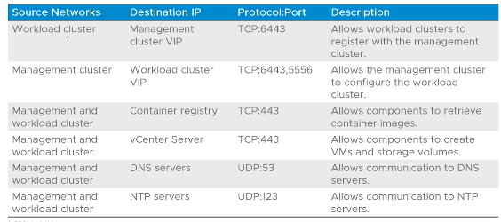

# 2.1 - Overview of Management Clusters and Preparing the vSphere

- [2.1 - Overview of Management Clusters and Preparing the vSphere](#21---overview-of-management-clusters-and-preparing-the-vsphere)
  - [Importance](#importance)
  - [vSphere Requirements](#vsphere-requirements)
  - [Port Requirements](#port-requirements)
  - [Dedicated vSphere SSO User](#dedicated-vsphere-sso-user)
  - [SSH Key Pairs](#ssh-key-pairs)
  - [OVA Templates](#ova-templates)
  - [Deploying in Internet-Restricted Environments](#deploying-in-internet-restricted-environments)

## Importance

- Tanzu Kubernetes Grid management clusters offer Kubernetes lifecycle functionality of Tanzu Kubernetes Grid for the supported platforms e.g. vSphere and the workload clusters within.

## vSphere Requirements

- For vSphere deployment, Tanzu Kubernetes Grid requires:
  - vSphere 6.7 Update 3, vSphere 7, VMWare Cloud on AWS or Azure VMware Solution
  - A vSphere cluster with minimum 2 ESXi hosts and vSphere DRS enabled
  - A DHCP server to provide IP addresses to Tanzu Kubernetes grid management and workload clusters
  - Traffic to vCenter server allowed from the network on which the clusters run
  - A dedicated vCenter SSO account with permissions required for Tanzu Kubernetes Grid

## Port Requirements

## Dedicated vSphere SSO User

- When deploying TKG using a dedicated vSphere SSO user, the TKG user should be assigned a role allowing access to the the following:
  - Datacenters or data center folders
  - Datastores or datastore folders
  - Hosts, clusters or resource pools
  - Networks to which the clusters are assigned
  - VM and template folders

## SSH Key Pairs

- An optional SSH public key is added to all VMs created by Tanzu Kubernetes Grid
- The SSH key is used to remotely connect to a VM using SSH to troubleshoot/manage the VMs
- If not provided, connecting to a control plane or worker node is not possible

## OVA Templates

- TKG provides base OS image templates in OVA format to import to vSphere:
  - Ubuntu v20.04 Kubernetes v1.xx.yy OVA (Default)
  - Photon v3 Kubernetes v1.xx.yy OVA
- TKG creates the management cluster and TK cluster node VMs from these templates
- After importing the OVA files, they must be converted to VM templates
- The base OS image template includes the version of Kubernetes that TKG uses to create clusters

## Deploying in Internet-Restricted Environments

- Deploying in an Internet-Restricted environment is supported by loading all container images into a private Docker registry
  - Within firewall - install and configure a private Docker registry e.g. Harbor
  - Run `docker pull` to pull all the images required
  - Use `docker tag` and `docker push` to push them into the private registry
  - Set any required environment variables e.g. `TKG_CUSTOM_IMAGE_REPOSITORY="registry URL"`
  - Proceed with the normal installation steps
