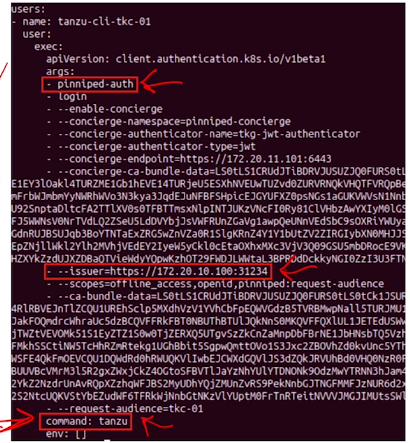
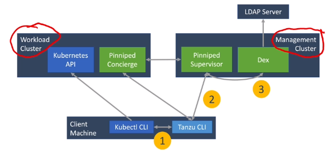
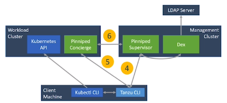
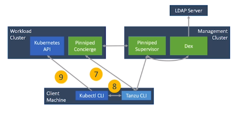

# 2.5 - Cluster Authentication

- [2.5 - Cluster Authentication](#25---cluster-authentication)
  - [Objectives](#objectives)
  - [External Authentication](#external-authentication)
  - [User Authentication - Pinniped](#user-authentication---pinniped)
  - [LDAP Authentication - Dex](#ldap-authentication---dex)
  - [KubeConfig File Setup - Pinniped](#kubeconfig-file-setup---pinniped)
  - [Pinniped Authentication Workflow](#pinniped-authentication-workflow)
  - [Pinniped Session Cache](#pinniped-session-cache)

## Objectives

- Describe how Kubernetes manages authentication
- Explain what Pinniped is
- Explain what Dx is
- Describe the Pinniped authentication workflow

## External Authentication

- Users aren't directly managed or authenticated by Kubernetes
- An external identity service must be used to generate trusted tokens or certificates for users to communicate with the Kubernetes API server
- Kubernetes supports OIDC tokens as a way to identify users accessing the cluster.

## User Authentication - Pinniped

- In TKG, user authentication is provided by Pinniped by default
- Allows integration of external OIDC OR LDAP identity providers into Tanzu Kubernetes clusters so access to said clusters can be controlled.

## LDAP Authentication - Dex

- Dex is an identity service that supports LDAP authentication
- Pinniped uses Dex if LDAP authentication is required.

## KubeConfig File Setup - Pinniped

- When Pinniped authentication is enabled, the `tanzu cluster kubeconfig get` command returns a kubeconfig file that's configured to run the Tanzu pinniped-auth plugin
- The plugin initiates the Pinniped authentication workflow
  - Users will be redirected to the Pinniped supervisor endpoint on the management cluster

## Pinniped Authentication Workflow

1. Kubectl calls the Tanzu CLI
2. Tanzu CLI realises that the user requesting doesn't have a token for authentication; opens a web browser to the Pinniped supervisor - redirecting to the Dex Login Page
3. The user provides their LDAP credentials and Dex authenticates with the LDAP server → Redirecting to Pinniped Supervisor

1. Pinniped Supervisor generates an ID token and passes it to the Tanzu CLI
2. The Tanzu CLI sends the token to Pinniped concierge on the workload cluster
3. Pinniped concierge swaps the ID token for client certificate via the Pinniped supervisor

1. The client certificate is passed to the Tanzu CLI
2. The client certificate is passed to kubectl
3. kubectl sends the client certificate with its request, the client certificate is already now trusted by the cluster and the user is authenticated.

## Pinniped Session Cache

- On successful login, the Tanzu CLI stores the client certificate to `~/.tanzu/pinniped/session.yaml`
- Deleting this file will require users to re-authenticate via the process outlined above.
