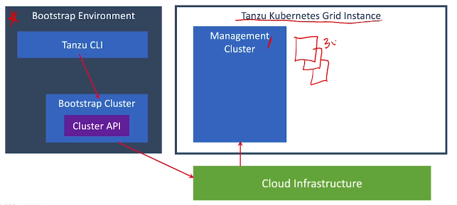
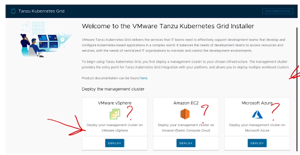
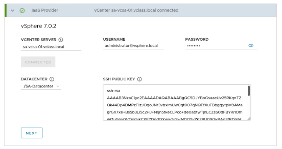
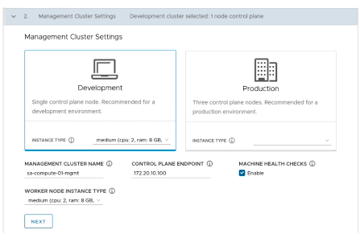
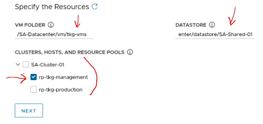

# 2.6 - Creating Management Clusters

- [2.6 - Creating Management Clusters](#26---creating-management-clusters)
  - [Objectives](#objectives)
  - [Installing TKG Instances](#installing-tkg-instances)
  - [Deploying Management Clusters - vSphere 7](#deploying-management-clusters---vsphere-7)
  - [Deploying Management Clusters: Installer UI or CLI](#deploying-management-clusters-installer-ui-or-cli)
  - [Tanzu CLI Management Cluster Plugin](#tanzu-cli-management-cluster-plugin)
    - [Tanzu CLI Management Cluster Create](#tanzu-cli-management-cluster-create)
  - [Tanzu Kubernetes Grid Installer](#tanzu-kubernetes-grid-installer)
  - [Post-Installation](#post-installation)
    - [Cluster API Configuration](#cluster-api-configuration)
    - [Infrastructure Configuration](#infrastructure-configuration)
  - [Management Cluster Deployment Workflow](#management-cluster-deployment-workflow)

## Objectives

- List the steps involved in installing a TKG Management Cluster
- Describe what occurs when a management cluster is created

## Installing TKG Instances

- The Tanzu CLI creates a temporary bootstrap cluster, which is used to create the management cluster.

- **Note:** Cluster = Collection of VMs (Nodes)

- The boostrap cluster will use the appropriate Cloud Infrastructure Provider to deploy the required resources

## Deploying Management Clusters - vSphere 7

- When deploying management clusters on vSphere 7, there are two options:
  - vSphere (Tanzu Enabled)
    - Deploying a management cluster isn't supported
    - The supervisor cluster performs the role of the management cluster
    - The Tanzu CLI connects to the **Supervisor cluster**
      - Carries out the roles associated with the management cluster
  - vSphere (Tanzu Disabled)
    - Deployed as per vSphere 6.7

## Deploying Management Clusters: Installer UI or CLI

- Management clusters can be deployed via two main methods:
  - Run the Tanzu Kubernetes Grid Installer
    - Wizard providing guidance through the deployment process
    - Recommended method - especially for platform operators new to TKG
    - Configuration generated by the installer UI is saved to a YAML configuration file
  - Create and edit YAML configuration files generated by the installer UI
    - More advanced configuration options can be added prior to deployment

## Tanzu CLI Management Cluster Plugin

- When deploying a management cluster using the Tanzu CLI, the `Tanzu Management-Cluster` plugin will be used

### Tanzu CLI Management Cluster Create

- When using `tanzu management-cluster create`:

## Tanzu Kubernetes Grid Installer

1. Access the installer UI - `tanzu management-cluster create --ui`
    1. Select the desired IaaS provider

1. Assuming vSphere's selected, provide vCenter FQDN, username and password
    1. Auto-determines version of vSphere
    2. For vSphere 7 and above - additional dialog will be added questioning if Tanzu is already enabled on the cluster → Determines whether TKG Management cluster can be deployed or not.
    3. Specify the SSH public key associated with the datacenter

1. Choose cluster plan to be developed and any additional configuration - development and production are pre-available by default
    1. Provide management cluster name
    2. Control plane endpoint - IP address for Kube-VIP to connect to
    3. Configure control plane and worker node size/resource configuration

1. Optional - Configure the NSX Load Balancer e.g.
    1. FQDN Name (VM to connect to)
    2. Credentials
    3. Certificate Authority
    4. Load Balancing-specific configuration
        1. VIP Network name
        2. VIP Network CIDR
2. Specify any metadata and labels to be applied to the cluster e.g. location, labels, description
3. Specify the VM folder, datastore and compute resource
    1. Outline where the VMs should be stored
    2. What cluster, hosts and resource pools should be utilised?
    3. What datastore should be used?

1. Specify the vSphere network, Kubernetes service and pod CIDR ranges
    1. Configure the CNI (Container Network Interface)
    2. Cluster CIDR - For Kubernetes services
    3. Cluster Pod CIDR
    4. Network name

1. Configure Identity Management
    1. What provider is being used?
    2. What configuration is required for that provider? E.g. LDAP has its own particular configuration requirements

1. Specify the base OS for Kubernetes to run on
    1. This will be the OS OVA file that was converted into a template
2. Register the Management cluster with Tanzu Mission control if desired
3. Deploy the cluster and wait
    1. Note the location where the configuration is stored.

---

## Post-Installation

- Once installation is complete, the browser can be closed.
- The management cluster configuration file generated by the installer is saved to `.tanzu/tkg/clusterconfigs`
- In the file are configuration parameters identical to those passed in the Wizard
  - E.g. Plan chosen
  - Kubernetes CIDRs
  - VM Characteristics

### Cluster API Configuration

- The cluster API components deployed to the management cluster are found at `.tanzu/tkg/providers`
  - `cluster-api/v0.3.13/core-components.yaml`
  - `control-plane-kubeadm/v0.3.14/control-plane-components.yaml`
  - `bootstrap-kubeadm/v0.3.14/bootstrap-components.yaml`

### Infrastructure Configuration

- Cluster API for vSphere controllers and CRDs listed in the following YAML file are deployed on the management cluster when running vSphere 6.7:
`.tanzu/tkg/providers/infrastructure-vsphere/v0.7.7/infrastructure-components.yaml`
- For vSphere 7 - no configuration is required as the supervisor cluster is preconfigured with Cluster API for vSphere controllers and CRDs
- AWS and Azure's provider deployment YAMLs are stored under the `.tanzu/tkg/providers/` folder if chosen as well

## Management Cluster Deployment Workflow

- The `tanzu management-cluster create` command:
    1. Validates the provided configuration
    2. Using `kind` it creates a local boostrap cluster on the boostrap machine
    3. The cluster API pods are deployed to the bootstrap cluster
    4. The requested management cluster configuration are deployed to the boostrap cluster using the Cluster API Custom Resource Definitions
    5. The cluster API provider for vSphere on the bootstrap cluster communicates with vSphere to clone and configure the cluster VMs in vSphere
    6. When the cluster is available, the Cluster API pods and configuration are moved to the vSphere management cluster
    7. The local bootstrap cluster is deleted

- **Note:** Deployment will output particular logs associated with each step

- Once deployment is completed, two VM types will be created,one for control plane nodes, another type for worker nodes.

