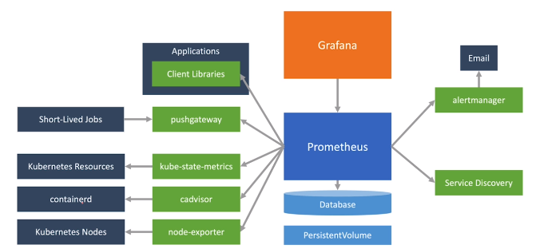
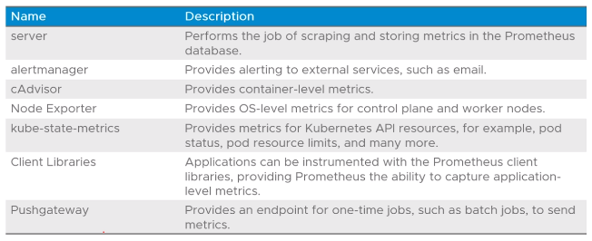
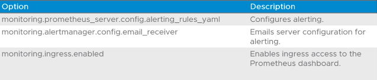
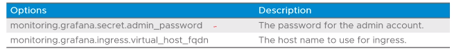

# 4.11 - Cluster Monitoring

Tags: Done

## Objectives

- Describe Prometheus
- Describe Grafana

## Monitoring

- TKG provides cluster monitoring services via the two projects:
  - Prometheus:
    - A systems monitoring and alerting toolkit
    - Collects metrics from clusters and applications at specific intervals
    - Triggers alerts depending on conditions
  - Grafana:
    - Visualization and analytics software
    - Allows query, visualization, and alerting operations for metrics; as well as alerting

## Architecture

## Prometheus Components

- Standard Prometheus deployment comes with the following components:

## Prometheus Configuration Options

- Default prometheus configuration values are generally fine, but for particular use cases the `prometheus-data-values.yaml` file can be edited with options such as:

## Grafana

- An open-source monitoring and observability platform
- Can connect to and pull data from many sources
- Provides dynamic dashboards, graphs and visualization for Prometheus backend data.

## Grafana Configuration Options

- Similar to Grafana configuration, the `grafana-data-values.yaml` file must be edited with parameters, including the following, to work:

