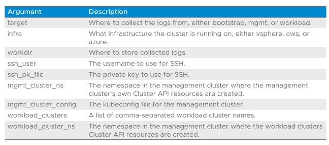

# 5.2 - Using Crash Diagnostics

- [5.2 - Using Crash Diagnostics](#52---using-crash-diagnostics)
  - [Objectives](#objectives)
  - [Crash Diagnostics (Crashd)](#crash-diagnostics-crashd)
  - [Diagnostic Scripts](#diagnostic-scripts)
  - [Default Diagnostics Script](#default-diagnostics-script)
  - [Passing Arguments to the Diagnostics Scripts](#passing-arguments-to-the-diagnostics-scripts)
  - [Default Diagnostic Script Arguments](#default-diagnostic-script-arguments)
  - [Running Crash Diagnostics](#running-crash-diagnostics)

## Objectives

- Describe the purpose of Crash Diagnostics

## Crash Diagnostics (Crashd)

- A command-line tool that facilitates investigation and troubleshooting of unhealthy or unresponsive Kubernetes clusters
- Only available on Linux or Mac OS
- Runs a series of scripts that collect Kubernetes API output, node logs, node CLI outputs through SSH to assess the health of the clusters

## Diagnostic Scripts

- Scripts included in crashd written in Starlark (a dialect of Python)
- Crashd exposes commonly used operations as Starlark functions used to build diagnostic scripts
- Examples:
  - Run kubectl and collect specified resources: `kube_capture (what="objects", kinds=["deployments", "services"], namespaces=["default"])`
  - Run a command through SSH on a particular node: `capture(cmd="df -h /", resources=nodes)`

## Default Diagnostics Script

- Crashd provides a default diagnostics script covering common use cases that:
  - Accepting arguments to specify what to collect
  - Collects bootstrap management and workload cluster information
  - Outputs an archive file containing all requested information

## Passing Arguments to the Diagnostics Scripts

- Two typical methods used:
  - An args file, used via `--args-file <args file>`
  - Specifying the args in key-value pairs in the CLI e.g. `--args key1=value1,key2=value2`

## Default Diagnostic Script Arguments

- The default diagnostics script accepts the following arguments amongst many others

## Running Crash Diagnostics

- Depending on whether using an args file or not, crashd is initiated via the following:
  - Passing the args from a file:
    - `crashd run --args-file <args file> <crashd script.crsh>`
  - Same as above but override the target and workload_cluster parameters:
    - `crashd run --args-file <args file> --args target=workload,workload_cluster=tkc-01 diagnostics.crsh`
