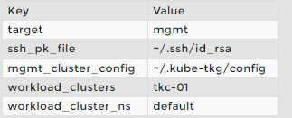

# 5.3 - Lab 15

- [5.3 - Lab 15](#53---lab-15)
  - [Install the Crash Diagnostics CLI](#install-the-crash-diagnostics-cli)
  - [Configure the Crash Diagnostics Arguments File](#configure-the-crash-diagnostics-arguments-file)
  - [Run the Crash Diagnostics CLI](#run-the-crash-diagnostics-cli)

## Install the Crash Diagnostics CLI

1. Using the terminal, navigate to the `Downloads` directory.

    `cd ~/Downloads`

2. Unzip the Crash Diagnostics CLI.

    `tar -zxvf crashd-linux-amd64-v0.3.2-vmware.3.tar.gz`

3. Install crashd to the `bin` directory.

    `sudo install crashd/crashd-linux-amd64-v0.3.2+vmware.3 /usr/local/bin/crashd`

4. Display the command syntax to verify that Crash Diagnostics is installed.

    `crashd --help`

## Configure the Crash Diagnostics Arguments File

1. Using the terminal, navigate to the `crashd` directory.

    `cd ~/Downloads/crashd`

2. Open `args` in Visual Studio Code.

    `code args`

    1. Modify the following parameters.

    

    1. Save the file and close Visual Studio Code.
3. Verify that the configuration file matches the reference configuration file.

    `checkconfig args`

    When a configuration mismatch exists, Visual Studio Code opens the configuration file in the left panel and the reference configuration file in the right panel.

    1. If a configuration mismatch exists, modify the configuration on the left to match the reference configuration on the right.

        Differences are highlighted in red.

    2. Save the file and close Visual Studio Code.

## Run the Crash Diagnostics CLI

1. Run the Crash Diagnostics CLI.

    `crashd run --debug --args-file args diagnostics.crsh`

    The logs are collected in the `workdir` directory and compressed to tkg-mgmt.diagnostics.tar.gz.

2. Display the collected logs.

    `find ./workdir/tkg-mgmt-cluster`

3. Run the command again, overwriting the target value.

    `crashd run --debug --args-file args --args target=workload diagnostics.crsh`

    The logs are collected in the `workdir` directory and compressed to tkc-01.diagnostics.tar.gz.

4. Display the collected logs.

    `tree -d -L 2 ./workdir/tkc-01 | less`
