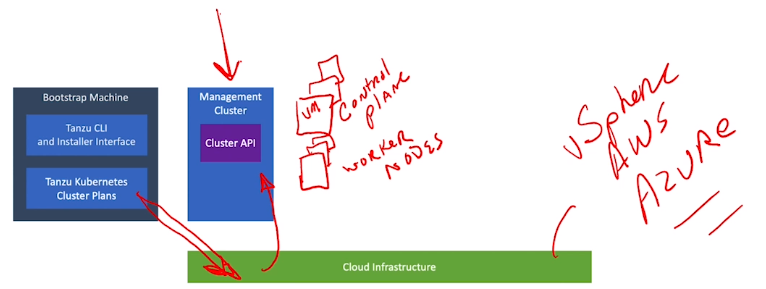
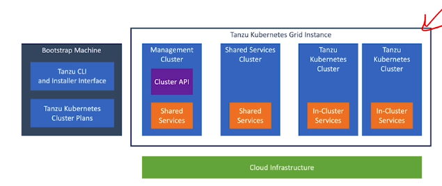
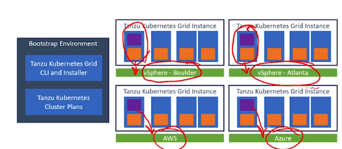

# 1.2 - Tanzu Kubernetes Grid Concepts

## Goals

- Describe the Tanzu Kubernetes Grid Concepts
- Describe the components of a Tanzu Kubernetes Grid instance

### Bootstrap Machine

- Typically a VM that runs the Tanzu CLI
- Used to initialize a Tanzu Kubernetes Grid instance by bootstrapping a management cluster on the cloud infrastructure of choice
- After bootstrapping the management cluster, the bootstrap machine is used to manage the Tanzu Kubernetes Grid Instance

### Tanzu CLI and Installer Interface

- Used to initialize a Tanzu Kubernetes Grid instance by creating a management clusters
- After the management cluster's created, the Tanzu CLI is used to create/scale/upgrade/delete Tanzu Kubernetes Clusters
- The installer interface is launched from the Tanzu CLI
  - A 9-step GUI wizard where you specify areas such as credentials, deployment locations, networking, etc.

## Tanzu Kubernetes Cluster Plans

- A cluster plan = blueprint that describes the configuration with which to deploy a Tanzu Kubernetes cluster.
- Provides a set of configurable values that determine its settings e.g.:
  - Control plane machine numbers
  - worker machine numbers
  - CPU and RAM values
- Two plans are provided by default:
  - **Dev**
  - **Prod**
- Existing cluster plans can be customised and new ones can be developed.

## Management Clusters

- Management cluster - the first element deployed when creating a Tanzu Kubernetes grid instance
- A cluster dedicated to running Cluster API, which provides lifecycle management support for Tanzu Kubernetes workload clusters
- The cluster is composed of one or more control plane nodes and one or more worker nodes.
- Tn vSphere with Tanzu, the supervisor cluster performs the role of the management cluster

## Tanzu Kubernetes Clusters

- These are Kubernetes clusters deployed from the management cluster by using the Tanzu CLI
- Composed of one or more control plane nodes and one or more worker nodes

- **Note:** Tanzu Kubernetes cluster and workload cluster are used interchangeably

- These clusters are created based on cluster plans
- The entire lifecycle of these Tanzu Kubernetes clusters can be managed by the Tanzu CLI e.g. version upgrades.

## Shared and In-Cluster Services

- These are services that run in a Tanzu Kubernetes Grid instance. They aim to support operations such as:
  - Authentication
  - Ingress
  - Logging
  - Service discovery
- Shared services run on the management cluster or a dedicated shared-services cluster, and can be used by multiple Tanzu Kubernetes clusters
- The Tanzu Kubernetes Grid extensions bundle is downloaded from the VMware website and provides the required YAML configurations
- In-cluster services are typically deployed to specific Tanzu Kubernetes clusters.
- Shared services can be deployed typically to their own clusters.

## Tanzu Kubernetes Grid Instances

- A Tanzu Kubernetes Grid instance is a full deployment of Tanzu Kubernetes Grid i.e.:
  - The management cluster
  - The deployed Tanzu Kubernetes clusters
  - The shared and in-cluster services configured for usage.

## Bootstrapping Many Instances

- A single bootstrap machine can bootstrap many instances of Tanzu Kubernetes Grid e.g.:
  - Environments e.g. production/development
  - IaaS providers e.g. vSphere, AWS
  - Failure domains e.g. <Cloud Provider Region 1>, <Cloud Provider Region 2>

## Registering with Tanzu Mission Control

- When bootstrapping multiple Tanzu Kubernetes Grid Instances, one can register all the instances with VMware Tanzu Mission Control to make the process easier.
- Tanzu Mission Control provides a centralized control plane for:
  - Applying consistent Kubernetes policies across clusters
  - Self-service provisioning and lifecycle management of clusters
  - Data protection of Kubernetes cluster workloads
