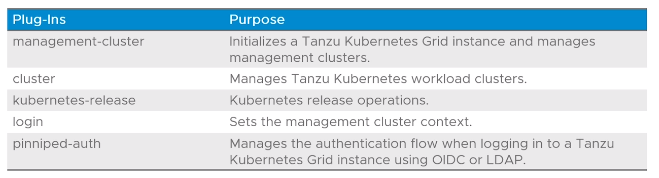
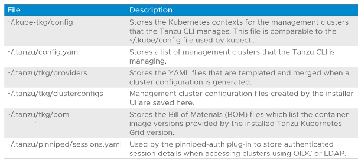
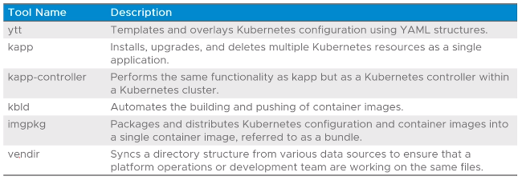

# 1.3 - The Tanzu CLI

## Objectives

- Describe Tanzu CLI
- List requirements for a bootstrap machine
- Describe the Carvel Tool Set

## Tanzu CLI

- Available on all major OS (Windows/Linux/Mac OS)
- Used to interact with different products in the VMWare Tanzu Portfolio
- Used with Tanzu Kubernetes Grid to:
  - Initialize a Tanzu Kubernetes Grid Instance
  - Create, scale, upgrade, and delete Tanzu Kubernetes clusters

## Tanzu CLI Plugins

- Each product associated with Tanzu makes up a plugin that works with the Tanzu CLI

### Installing Plugins

- Various methods available:
  - From the internet: `tanzu plugin install <plugin name>`
  - From a local directory: `tanzu plugin install <plugin name> --local <dir>`
  - All available plugins: `tanzu plugin install all |--local <directory>|`

## Tanzu CLI Syntax

- General syntax format: `tanzu <resource> |<sub-resource>| <verbs> --<options>`
- Examples:
  - `tanzu management-cluster get`
  - `tanzu cluster create --file </path/to/file.yaml>`
  - `tanzu cluster list`
  - `tanzu cluster get <cluster name>`
  - `tanzu cluster kubeconfig get --admin`
  - `tanzu kubernetes-release get`

## CLI Configuration Files

- The following CLI configuration files are created via the Tanzu CLI:

- TLDR:
  - config - stores Kubernetes contexts for management clusters managed by the Tanzu CLI
  - config.yaml - List of management clusters managed by the Tanzu CLU
  - providers - Sores YAMLs templated and merged when cluster configuration is generated
  - clusterconfigs - management cluster configuration files created by the installer UI
  - bom - Bill of Materials files - list container image versions provided by installed TKG version e.g Pod images
  - sessions.yaml - used by pinniped-auth plugin to store authenticated session details when accessing clusters.

## Bootstrap Machine Requirements

- as this is where a Tanzu Kubernetes Grid instance will be initialized, there are prerequisites:
  - Kubectl must be installed
  - Docker must be installed (CLI for Linux), Desktop for Mac or Windows
  - Minimum 6Gb memory for the containers used during the bootstrapping process
  - IP network connectivity to the vCenter Server instance and the network where the management cluster is to be deployed.

## Installer Interface

- The TKG installer interface is a GUI wizard that guides the configuration of a management cluster.
- To start it up: `tanzu management-cluster create --ui`
- First step to select IaaS system e.g. vSphere, AWS, Azure

## Carvel Tools

- A collection of CLI tools that help in building, configuring and deploying Kubernetes/Kubernetes-based workloads

