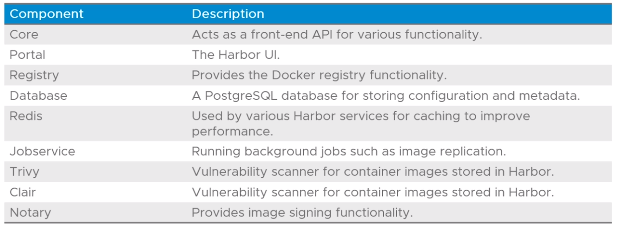
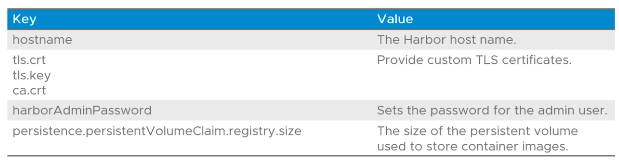

# 4.04 - Image Registry

Tags: Done

# About Harbor

- A container image registry that supports:
  - RBAC
  - Identity Integration with LDAP and OIDC
  - Scanning images for vulnerabilities
  - Signed images
  - Image replication between registries.

# Harbor Components

- Components included in Harbor follow:

- Note: Scanning is available either via Trivy or Clair

# Vulnerability Scanning

- Trivy provides multiple vulnerability scanning functionality in Harbor:
  - Scans container images
  - Scans OS packages in container images e.g. Photon OS, Ubuntu, etc.
  - Scans language-specific packages in container images e.g. Python, GO, etc.
    - Clair lacks this functionality!
- Configuration can be put in place to prevent image deployments depending on the level of vulnerabilities found.

# Harbor Deployment Options

- Harbor is deployed on a shared-services cluster - all workload clusters deployed in a TKG instance can therefore access it.
- Common configuration options follow:

# Harbor Authentication

- Configuration → Authentication
  - Allows configuration of LDAP and OIDC, amongst other methods, depending on requirements
