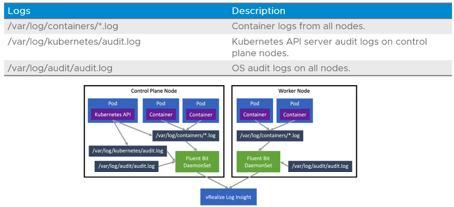
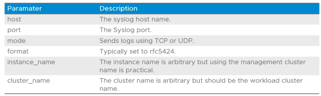

# 4.05 - Logging

Tags: Done

# Learner Objectives

- Describe FluentBit
- Detail the logs collected by FluentBit
- Describe basic Fluentbit configuration

# Fluentbit Overview

- A lightweight logging framework
- Functionality includes:
  - Processing of Kubernetes container logs
  - Enriches logs with Kubernetes metdata
  - Outputs logs to various services including:
    - vRealize Log Insight
    - Syslog
    - Elasticsearch
    - Splunk
    - HTTP Endpoint

# Configuration and Deployment

- FluentBit is deployed as a Daemonset by default (runs on all nodes!)
- Configuration files and architecture follow:

- Depending on what logs are enabled, FluentBit collates all logs and outputs it to the desired service endpoint.

# Metadata Considered

- Fluentbit includes metadata such as:
  - Pod ID
  - Pod Name
  - Container ID
  - Container Name
  - Labels
  - Annotations
  - Cluster name
  - Instance Name

# Fluentbit Syslog Output Configuration

- When configuring output to syslog, the following parameters should be considered:

