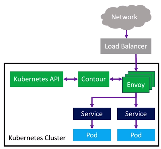
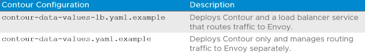

# 4.07 - Ingress

Tags: Done

# Objectives

- Describe the Contour Ingress Controller
- Explain how to install Contour to a Tanzu Kubernetes cluster

# Ingress Overview

- A method used in Kubernetes for routing external traffic to pods
- Operates on layer 7 traffic
- Routes requests based on HTTP headers
- Can be implemented via various tools including:
  - Contour
  - NGINX
  - Amazon ALB
  - NSX Advanced Load Balancer

# Contour Overview

- An open-source Kubernetes ingress controller
- Used as the default ingress controller for Tanzu Kubernetes Grid
- Supports Ingress and HTTPProxy resources
- Comprised of a Contour controller deployment and Envoy proxy Daemonset
  - Envoy used to perform traffic routing - handles rerouting traffic based on rules in place
- Supports dynamic configuration updates based on `kubectl apply` commands etc.

# HTTPProxy Resources

- Match requests based on the configured virtualhost FQDN field
- Routes requests based on routes matching the ULR path to the defined service and port
- R
- Supports conditional routing based on URL prefixes and HTTP headers
- Supports inclusion of one HTTPProxy resource within another - creating tree-like routing structures
- Example resource:

```yaml
apiVersion: projectcontour.io/v1
kind: HTTPProxy
metadata:
  name: basic
spec:
  virtualhost:
    fqdn: foo-basic.bar.com
  routes:
    - conditions:
      - prefix: /
      services:
        - name: s1
          port: 80
```

# How Contour Works

- Contour deployment dynamically configures an Envoy proxy DaemonSet by using the following steps:

1. Contour watches the Kubernetes API for Ingress or HTTPProxy resources
2. Contour generates a cache of ingress and HTTPProxy resources
3. Envoy periodically polls Contour for configuration changes
4. Envoy dynamically updates its routing configuration
5. Requests are received from a load balancer or directly from the external network and routed to the correct pods.



# Contour Configuration

- Under `extensions/ingress/contour/vsphere` - the following two config files are required:



- The default Contour configuration is suitable for most deployments
- Advanced options can be added, such as:
  - `requestTimeout`
  - `connectionIdleTimeout`
  - `minimumProtocolVersion` (TLS)
- Additional options are available in the TKG documentation
