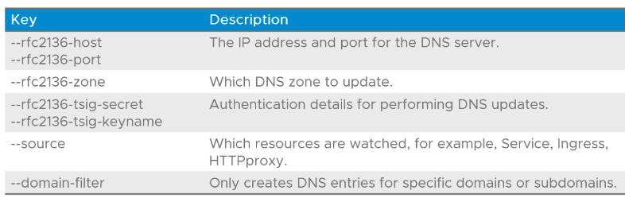

# 4.09 - Service Discovery

Tags: Done

# Objectives

- Describe Service Discovery
- Describe External DNS
- Detail the configuration options for BND Servers

# Service Discovery Overview

- Kubernetes provides a declarative API for deploying apps, services, ingress and load balancer resources
- Services, ingress, load balancer resources provide methods to route external IP network traffic into a cluster and to an application.
  - IP addresses can change as workloads are created and destroyed
- Service discovery solves the problem of the above by allowing applications to be registered in a service registry
  - This can be queried by applications and end users needing access to a particular application.
- Additionally, this external registry should be regularly updated whenever these resources are changed.

# External DNS Overview

- A service discovery solution that:
  - Uses DNS as a service registry
  - Uses FQDNs defined in Ingress, HTTPproxy and Load Balancer resources
  - Creates DNS entries for applications in the configured DNS server
  - Allows users and applications outside a cluster to use DNS to access workloads inside a cluster

# DNS Servers Supported by External DNS

- RFC2136 (BIND) Server
- Microsoft DNS using RFC2136 (Insecure) or RFC3645 (Secure)
- AWS Route 53
- Microsoft Azure

# How External DNS Works

- External DNS:
  - Watches for hostnames in Kubernetes API resources
    - Ingress and HTTPproxy resources are watched for host field values in each rule defined
    - Load balancer resources are watched for `[external-dns.alpha.kubernetes.io/hostname](http://external-dns.alpha.kubernetes.io/hostname)` annotations
  - Creates a DNS entry in the configured DNS server that points to the ingress or Load Balancer IP
  - Deletes the DNS entry when the ingress / HTPProxy / LoadBalancer resources are deleted

# External DNS Configuration for BIND Servers

- Example configuration files are of the format `external-dns-data-values-<type>.yaml`
  - The config files determines how load balancers are watched for External DNS annotations
- To have External DNS watch for Contour Ingress and HTTPproxy resources, the file used will be `external-dns-data-values-rfc2136-with-contour.yaml`
- The following parameters are typically defined when working with a BIND server.

