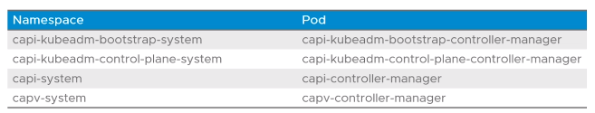

# 5.1 - Tanzu Kubernetes Grid Logs

# Context

- Understanding how to identify and resolve issues is vital to efficient operation of TKG.

# Objectives

- Describe the logs of TKG
- Identify the location of TKG logs

# Monitoring Tanzu Kubernetes Cluster  Deployments in Cluster API Logs

- If a cluster deployment is failing, the reason can usually be deduced from the logs for the Cluster API pods via `kubectl logs`
- During a management cluster deployment, these logs are accessible on the bootstrap cluster
- For a workload cluster deployment, they are accessible on the management cluster
- Pods whos logs should be noted and their associated namespaces follow:

# Viewing Cluster API Resources

- Each cluster deployed via TKG has corresponding cluster API resources that can be viewed by the `kubectl describe` commands
  - Resources covered include:
    - clusters
    - kubeadmconfigs
    - machinedeployments
    - machinesets
    - machines
    - vsphereclusters
    - haproxyloadbalancerss
    - vspherevms

# Kubernetes Audit Logging

- Enabled by setting `ENABLE_AUDIT_LOGGING=true` in the configuration file when deploying a cluster
  - Logs metadata regarding all requests made to the Kubernetes API server
  - Audit events logged to `/var/log/kubernetes/audit.log` on each control plane node
- Audit logs are by default included in the logs sent to the FluentBit logging server

# System Audit Logging

- Enabled by default on Tanzu Kubernetes clusters
- Uses the auditd system to track audit events
- Logs audit events to `/var/log/audit/audit.log` on each node
- Included in the logs sent to the FluentBit logging server
